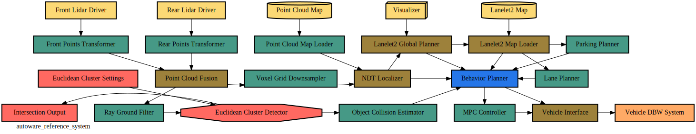

# Overview [](https://github.com/ros-realtime/reference-system/actions/workflows/colcon-build.yml)

With the distributed development of ROS across many different organizations it is sometimes hard to benchmark and concretely show how a certain change to a certain system improves or reduces the performance of that system.  For example did a change from one executor to another actually reduce the CPU or was it something else entirely?

In order to try and address this problem we at [Apex.AI](https://apex.ai) would like to propose a definition of a [_reference system_](#reference-system) that simulates a real world scenario - in this first case Autoware.Auto and its lidar data pipeline - that can be repeated no matter the underlying change of any piece of the full stack (i.e. executor, DDS or even RMW).



Future _reference systems_ could be proposed that are more complex using the same basic node building blocks within the `reference_system` package.

## Reference System

A _reference system_ is defined by:
- A [platform](#supported-platforms) is defined by:
    - Hardware (e.g. an off-the-shelf single-board computer, embedded ECU, etc.)
        - if there are multiple configurations available for such hardware, ensure it is specified
    - Operating System (OS) like RT linux, QNX, etc. along with any special configurations made
- for simplicity and ease of benchmarking, **all nodes must run on a single process**
- a fixed number of nodes
    - each node with:
        - a fixed number of publishers and subscribers
        - a fixed _processing time_ or a fixed _publishing rate_
- a fixed _message type_ of fixed size to be used for every _node_.

With these defined attributes the _reference system_ can be replicated across many different possible configurations to be used to benchmark each configuration against the other in a reliable and fair manner.

With this approach [portable and repeatable tests](#testing) can also be defined to reliably confirm if a given _reference system_ meets the requirements.

## Supported Platforms

To enable as many people as possible to replicate this reference system, the platform(s) were chosen to be easily accessible (inexpensive, high volume), have lots of documentation, large community use and will be supported well into the future.

Platforms were not chosen for performance of the reference system - we know we could run “faster” with a more powerful CPU or GPU but then it would be harder for others to validate findings and test their own configurations.  Accessibility is the key here and will be considered if more platforms want to be added to this benchmark list.

**Platforms:** 
 - [Raspberry Pi 4B](https://www.raspberrypi.org/products/raspberry-pi-4-model-b/):
    - 4 GB RAM version is the assumed default
        - other versions could also be tested / added by the community
    - [real-time linux kernel](https://github.com/ros-realtime/rt-kernel-docker-builder)

*Note: create an [issue](https://github.com/ros-realtime/reference-system-autoware/issues/) to add more platforms to the list, keeping in mind the above criteria*

## Concept Overview

Rather than trying to write code to cover all potential variations of executors, APIs, and future features we cannot even imagine today we have chosen instead to define what we call a “reference system” based on part of a real-world system, [Autoware.Auto](https://www.autoware.org/autoware-auto).

The above node graph can be boiled down to only a handful of node "types" that are replicated to make this complex system:

**Node Types:**

1. [**Sensor Node**](reference_system/include/reference_system/nodes/rclcpp/sensor.hpp)
    - input node to system
    - one publisher, zero subscribers
    - publishes message cyclically at some fixed frequency
2. [**Transform Node**](reference_system/include/reference_system/nodes/rclcpp/transform.hpp)
    - one subscriber, one publisher
    - starts processing for N milliseconds after a message is received
    - publishes message after processing is complete
3. [**Fusion Node**](reference_system/include/reference_system/nodes/rclcpp/fusion.hpp)
    - 2 subscribers, one publisher
    - starts processing for N milliseconds after a message is received **from all** subscriptions
    - publishes message after processing is complete
4. [**Cyclic Node**](reference_system/include/reference_system/nodes/rclcpp/cyclic.hpp)
    - N subscribers, one publisher
    - cyclically processes all received messages since the last cycle for N milliseconds
    - publishes message after processing is complete
5. [**Command Node**](reference_system/include/reference_system/nodes/rclcpp/command.hpp)
    - prints output stats everytime a message is received
6. [**Intersection Node**](reference_system/include/reference_system/nodes/rclcpp/intersection.hpp)
    - behaves like N transform nodes
    - N subscribers, N publisher bundled together in one-to-one connections
    - starts processing on connection where sample was received
    - publishes message after processing is complete

These basic building-block nodes can be mixed-and-matched to create quite complex systems that replicate real-world scenarios to benchmark different configurations against each other.

## Reference Systems Overview

The first reference system benchmark proposed is based on the *Autoware.Auto* lidar data pipeline as stated above and shown in the node graph image above as well.

1. [**Autoware Reference System**](autoware_reference_system/README.md)
    - ROS2:
        - Executors:
            - Default:
                - [Single Threaded](autoware_reference_system/src/ros2/executor/autoware_default_singlethreaded.cpp)
                - [Static Single Threaded](autoware_reference_system/src/ros2/executor/autoware_default_staticsinglethreaded.cpp)
                - [Multithreaded](autoware_reference_system/src/ros2/executor/autoware_default_multithreaded.cpp)

Results below show various characteristics of the same simulated system (Autoware.Auto).

To add your own executor to the list above follow the [*how to add your custom executor*](#how-to-implement-your-custom-executor) section below.

## Benchmark Results

Results will be added to different tagged releases along with the specific configurations ran during the tests.

## Testing and Dependencies

Tests and dependencies will be written uniquely for each _reference system._

Please go to the `README.md` file specific for the _reference system_ you would like to run to view the instructions on how to set it up and run yourself.

- [Autoware Reference System](autoware_reference_system/README.md)

### PICAS Executor ###
Use `-DPICAS=TRUE` to build the [PICAS executor](https://github.com/rtenlab/ros2-picas). For more details, see [README.md](autoware_reference_system/README.md) in `Autoware Reference System`.

## Contributing

If you see a missing configuration on the list above that you would like to see benchmarked against please follow the steps below to request it to be added.

- look over the open / closed [issues](https://github.com/ros-realtime/reference-system-autoware/issues/) to make sure there isn't already an open ticket for the configuration you are looking for
create `include/reference_system/MY_EXECUTOR_NAME_nodes`

## How to Implement Your Custom Executor 

1. Read over [the above documentation](#concept-overview) on the base node types
2. Review the base [`rclcpp nodes`](reference_system/include/reference_system/nodes/rclcpp) that are provided and determine if your executor can use them
3. If you cannot, implment your own version of each base node type and place the source in [with the other nodes in the `reference_system`.](reference_system/include/reference_system/nodes)
4. Add your new nodes as a seperate `node system` in [the `reference_system` package](reference_system/include/reference_system/system/systems.hpp)
5. Copy one of the provided example `.cpp` files from the [`src/ros2/executor`](autoware_reference_system/src/ros2/executor) directory and replace the `create_autoware_nodes` template type with your new `node system` which should be in the `system/systems.hpp` file already included
6. Add new `.cpp` source file as a new executable in the `CMakelist.txt`
7. Add new executable to test wtihin the `CMakelist.txt`
8. Build and run tests!


# Accelerator Access Management Framework

### Packages:

1. aamf_server_interfaces
2. aamf_server
3. rclcpp (PiCAS scheduling)
4. autoware_reference_system (and dependencies
)
#### Dependencies

1. Ubuntu 20.04 LTS (Jetpack 5.1.1 for Jetson AGX Xavier 35.3.1)
2. [ROS2 Galactic](https://docs.ros.org/en/galactic/Installation/Ubuntu-Install-Debians.html)
3. GCC v9.3+
4. [CUDA 11.4+](https://developer.nvidia.com/cuda-11-7-0-download-archive?target_os=Linux&target_arch=x86_64&Distribution=Ubuntu&target_version=20.04) (Tested with 11.2-11.8)
5. Nvidia Driver 510.XX+(others may work, only tested with 510-535)
6. OpenCV 4.5.4
7. CV_Bridge
8. [CuDNN 8.2.4+](https://docs.nvidia.com/deeplearning/cudnn/install-guide/index.html)
9. Boost
10. Tensorflow Lite

## Install Dependencies in Order

1. Uninstall any ROS2 prebuilt binaries (e.g. sudo apt remove ros-galactic*)
2. Uninstall libopencv-dev (sudo apt remove libopencv*)
3. Download and install Nvidia Drivers.
4. Download and install cuda 11.4+.
5. Download and install CuDNN 8.6.0.166+
6. Download and install OpenCV 4.5.4 (Replace CUDA_ARCH_BIN=7.2 with the compute capability of your nvidia card)


```bash
sudo apt install libcudnn8-dev
mkdir -p ~/opencv_build
cd ~/opencv_build
git clone https://github.com/opencv/opencv.git
git clone https://github.com/opencv/opencv_contrib.git
cd opencv/
git checkout 4.5.4
git pull origin 4.5.4
mkdir build
cd ../opencv_contrib
git checkout 4.5.4
git pull origin 4.5.4
cd ../opencv/build

cmake -D CMAKE_BUILD_TYPE=RELEASE \
    -D CMAKE_INSTALL_PREFIX=/usr/local \
    -D WITH_TBB=ON \
    -D ENABLE_FAST_MATH=1 \
    -D WITH_FFMPEG=ON \
    -D CUDA_FAST_MATH=1 \
    -D WITH_CUBLAS=1 \
    -D WITH_CUDA=ON \
    -D BUILD_opencv_cudacodec=OFF \
    -D WITH_CUDNN=ON \
    -D CUDNN_LIBRARY=/usr/local/cuda/targets/aarch64-linux/lib/libcudnn.so \
    -D CUDNN_INCLUDE_DIR=/usr/local/cuda/targets/aarch64-linux/include \
    -D OPENCV_DNN_CUDA=ON \
    -D BUILD_opencv_world=ON \
    -D CUDA_ARCH_BIN=7.2 \
    -D WITH_V4L=ON \
    -D WITH_QT=OFF \
    -D WITH_OPENGL=ON \
    -D WITH_GSTREAMER=ON \
    -D OPENCV_GENERATE_PKGCONFIG=ON \
    -D OPENCV_PC_FILE_NAME=opencv.pc \
    -D INSTALL_C_EXAMPLES=OFF \
    -D INSTALL_PYTHON_EXAMPLES=OFF \
    -D OPENCV_GENERATE_PKGCONFIG=ON \
    -D OPENCV_EXTRA_MODULES_PATH=/home/daniel/Research/opencv_build/opencv_contrib/modules \
    -D BUILD_EXAMPLES=OFF ..
make -j$(nproc)
sudo make install
```
7. Download Ros2 Galactic and compile from source
```bash
sudo apt update && sudo apt install -y \
  build-essential \
  cmake \
  git \
  python3-colcon-common-extensions \
  python3-flake8 \
  python3-pip \
  python3-pytest-cov \
  python3-rosdep \
  python3-setuptools \
  python3-vcstool \
  wget

python3 -m pip install -U \
  flake8-blind-except \
  flake8-builtins \
  flake8-class-newline \
  flake8-comprehensions \
  flake8-deprecated \
  flake8-docstrings \
  flake8-import-order \
  flake8-quotes \
  pytest-repeat \
  pytest-rerunfailures \
  pytest \
  setuptools

mkdir -p ~/ros2_galactic/src
cd ~/ros2_galactic
vcs import --input https://raw.githubusercontent.com/ros2/ros2/galactic/ros2.repos src
sudo apt upgrade
sudo rosdep init
rosdep update
rosdep install --from-paths src --ignore-src -y --skip-keys "fastcdr rti-connext-dds-5.3.1 urdfdom_headers"
sudo apt remove libopencv*
cd ~/ros2_galactic/
touch  ~/Research/ros2_galactic/src/ros-visualization/qt_gui_core/qt_gui_cpp/COLCON_IGNORE
touch  ~/Research/ros2_galactic/src/ros-visualization/rqt/rqt_gui_cpp/COLCON_IGNORE
vim ~/Research/ros2_galactic/src/ros-visualization/rqt/rqt/setup.py
# Add the following lines: after version='1.1.2'
py_modules=[],

cd ~/ros2_galactic/src/ros-perception
git clone https://github.com/ros-perception/vision_opencv.git
cd vision_opencv
git checkout galactic
git pull origin galactic
cd ~/ros2_galactic/
colcon build --symlink-install

```


## Configure Environment
Substitute 'cuda' with your cuda version if necessary, or create a symbolic link.

```bash
echo "source ~/ros2_galactic/setup.bash" >> ~/.bashrc
echo "export PATH=/usr/local/cuda/bin:$PATH" >> ~/.bashrc
echo "export LD_LIBRARY_PATH=/usr/local/cuda/lib64:$LD_LIBRARY_PATH" >> ~/.bashrc
echo "RMW_IMPLEMENTATION=rmw_cyclonedds_cpp" >> ~/.bashrc
echo "export ROS_LOCALHOST_ONLY=1" >>  ~/.bashrc
source ~/.bashrc
```


## Building the package

1. Install Ros Galactic
2. Clone this workspace
3. Build the workspace

```bash
colcon build --symlink-install --cmake-args -DCMAKE_BUILD_TYPE=RelWithDebInfo -DPICAS=TRUE -DAAMF=TRUE
```

4. To build a specific package run:

```bash
colcon build --symlink-install --cmake-args -DCMAKE_BUILD_TYPE=RelWithDebInfo -DPICAS=TRUE -DAAMF=TRUE --packages-select PACKAGE_NAME
```

## Running the example
In three separate terminals, as the *root* user, run the following to test the server
```bash
 iox-roudi -c /full/path/to/reference_system_aamf/roudi.toml
```
```bash
source /root_dir/src/install/setup.bash
export CYCLONEDDS_URI=file:///full/path/to/reference_system_aamf/cyclonedds.xml
RMW_IMPLEMENTATION=rmw_cyclonedds_cpp ./build/aamf_server/aamf_server
```
```bash
source /root_dir/src/install/setup.bash
export CYCLONEDDS_URI=file:///full/path/to/reference_system_aamf/cyclonedds.xml
RMW_IMPLEMENTATION=rmw_cyclonedds_cpp ./build/test_package_name/test_package args

```
## Compile options:
-DAAMF - enables aamf clients

-DOVERHEAD_DEBUG - enables logging for overhead

-DDIRECT_INVOCATION - enables the direct invocation of kernels

-DPICAS - enables the PiCAS scheduling of callbacks

-DAAMF_PICAS - enables PiCAS scheduling of callbacks from clients using AAMF 
 
 Note: compile options -DAAMF and -DDIRECT_INVOCATION should never be enabled simultaneously. 
 Note 2: -DPICAS is required to be enabled in rclcpp for the aamf_server package. -- to test clients without PiCAS, it is preferred to set '-DAAMF_PICAS=FALSE' and recompile with PiCAS enabled '-DPICAS=TRUE'
## Setup Raspberry Pi 4 for the test

The goal is to provide a clean computation environment for the test avoiding an interference of other Ubuntu components.

### Setup a constant CPU frequency

Frequency is setup to 1.50 GHz for all CPUs

```bash
# run it as root
sudo su

echo -n "setup constant CPU frequency to 1.50 GHz ... "
# disable ondemand governor
systemctl disable ondemand

# set performance governor for all cpus
echo performance | tee /sys/devices/system/cpu/cpu*/cpufreq/scaling_governor >/dev/null

# set constant frequency
echo 1500000 | tee /sys/devices/system/cpu/cpu*/cpufreq/scaling_min_freq >/dev/null
echo 1500000 | tee /sys/devices/system/cpu/cpu*/cpufreq/scaling_max_freq >/dev/null

# reset frequency counters
echo 1 | tee /sys/devices/system/cpu/cpu*/cpufreq/stats/reset >/dev/null

echo done

sleep 1
# get freq info
echo `cpufreq-info | grep stats | cut -d ' ' -f 23-25`
```

### Isolate CPUs

CPU 2,3 are isolated to run tests.

```bash
sudo apt install -y sysstat u-boot-tools
```

```bash
# modify kernel cmdline
cd ~
dd if=/boot/firmware/boot.scr of=boot.script bs=72 skip=1

# edit boot.script and modify bootargs to
ubuntu@ubuntu:~$ cat boot.script | grep "setenv bootargs" | head -1
setenv bootargs " ${bootargs} rcu_nocbs=2,3 nohz_full=2,3 isolcpus=2,3 irqaffinity=0,1 audit=0 watchdog=0 skew_tick=1 quiet splash"

# generate boot.scr
mkimage -A arm64 -O linux -T script -C none -d boot.script boot.scr

# replace boot.scr
sudo cp boot.scr /boot/firmware/boot.scr

sudo reboot

# check cmdline
ubuntu@ubuntu:~$ cat /proc/cmdline
 coherent_pool=1M 8250.nr_uarts=1 snd_bcm2835.enable_compat_alsa=0 snd_bcm2835.enable_hdmi=1 bcm2708_fb.fbwidth=0 bcm2708_fb.fbheight=0 bcm2708_fb.fbswap=1 smsc95xx.macaddr=DC:A6:32:2E:5
4:97 vc_mem.mem_base=0x3ec00000 vc_mem.mem_size=0x40000000  net.ifnames=0 dwc_otg.lpm_enable=0 console=ttyS0,115200 console=tty1 root=LABEL=writable rootfstype=ext4 elevator=deadline roo
twait fixrtc rcu_nocbs=2,3 nohz_full=2,3 isolcpus=2,3 irqaffinity=0,1 audit=0 watchdog=0 skew_tick=1 quiet splash

# check interrupts
# Only the number of interrupts handled by CPU 0,1 increases.
watch -n1 cat /proc/interrupts

# check soft interrupts
watch -n1 cat /proc/softirqs

# check isolated CPUs
cat /sys/devices/system/cpu/isolated
2-3
cat /sys/devices/system/cpu/present
0-3

# run reference system on CPU2
taskset -c 2 install/autoware_reference_system/lib/autoware_reference_system/autoware_default_singlethreaded > /dev/null

# get pid
RF_PID=`pidof autoware_default_singlethreaded` && cat /proc/$RF_PID/status | grep ^Cpu

# check how many threads are running
ps -aL | grep $RF_PID
   3835    3835 ttyS0    00:03:46 autoware_defaul
   3835    3836 ttyS0    00:00:00 autoware_defaul
   3835    3837 ttyS0    00:00:00 autoware_defaul
   3835    3838 ttyS0    00:00:00 autoware_defaul
   3835    3839 ttyS0    00:00:00 gc
   3835    3840 ttyS0    00:00:00 dq.builtins
   3835    3841 ttyS0    00:00:00 dq.user
   3835    3842 ttyS0    00:00:00 tev
   3835    3843 ttyS0    00:00:00 recv
   3835    3844 ttyS0    00:00:00 recvMC
   3835    3845 ttyS0    00:00:00 recvUC
   3835    3846 ttyS0    00:00:00 autoware_defaul
```

## Hints

* If you run `colcon build` on a Raspberry Pi 4 with little memory, use `export MAKEFLAGS="-j 1"` to inhibit parallelism. Otherwise, the system could hang due to memory swapping.
